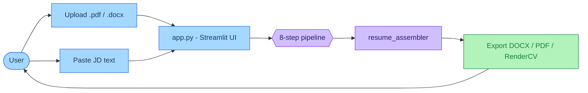
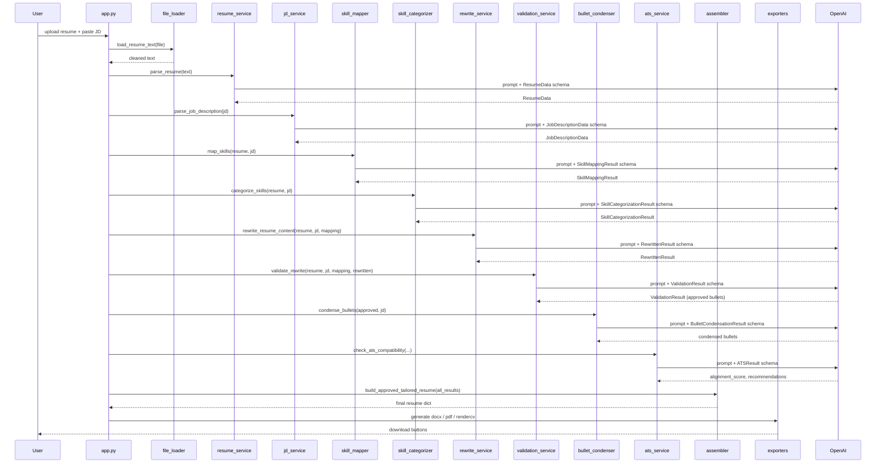
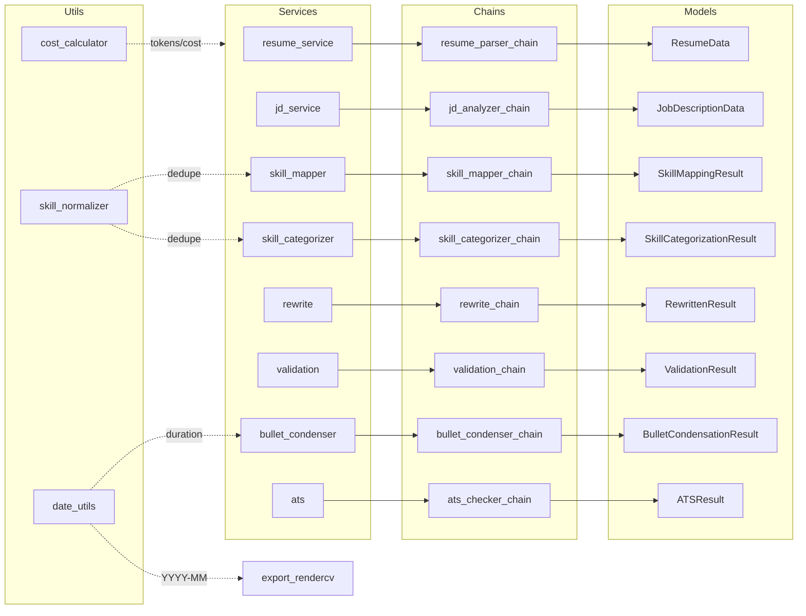

# AI Resume Assistant — Architecture

A reference map of the project's modules and data flow. Built from a walk through the actual code in `app.py`, `src/services/`, `src/chains/`, `src/models/`, and `src/utils/`.

## High-level pipeline



## Detailed module map

```mermaid
flowchart TB

    %% =============== INPUT & UI ===============
    subgraph UI["INPUT & UI LAYER"]
        direction LR
        IN1[/"Resume upload<br/>(.pdf / .docx)"/]
        IN2[/"JD text"/]
        FL["file_loader.py<br/>load_resume_text()<br/>extract_text_from_pdf (pdfplumber)<br/>extract_text_from_docx (python-docx)<br/>clean_text()"]
        APP["app.py — Streamlit UI<br/>resolve_openai_key()<br/>orchestrates pipeline<br/>renders preview + downloads"]
        IN1 --> FL --> APP
        IN2 --> APP
    end

    %% =============== SERVICES ===============
    subgraph SVC["SERVICES LAYER (src/services/)"]
        direction TB
        S1["resume_service<br/>parse_resume(text, key)"]
        S2["jd_service<br/>parse_job_description(jd, key)"]
        S3["skill_mapper_service<br/>map_skills(resume, jd, key)"]
        S4["rewrite_service<br/>rewrite_resume_content(...)"]
        S5["validation_service<br/>validate_rewrite(...)"]
        S6["ats_service<br/>check_ats_compatibility(...)"]
        S7["bullet_condenser_service<br/>condense_bullets(...)<br/>+ helpers _build_jd_signals,<br/>_enforce_counts, _fallback_result"]
        S8["skill_categorizer_service<br/>categorize_skills(...)<br/>+ _fallback_result"]
        ASM["resume_assembler_service<br/>build_approved_tailored_resume(...)<br/>_apply_condensed_experiences<br/>_apply_condensed_projects"]
    end

    %% =============== CHAINS ===============
    subgraph CHN["CHAINS LAYER (src/chains/)"]
        direction TB
        C1["get_resume_parser_chain"]
        C2["get_jd_analyzer_chain"]
        C3["get_skill_mapper_chain"]
        C4["get_rewrite_chain"]
        C5["get_validation_chain"]
        C6["get_ats_checker_chain"]
        C7["get_bullet_condenser_chain"]
        C8["get_skill_categorizer_chain"]
    end

    %% =============== LLM ===============
    LLM[("OpenAI ChatOpenAI<br/>langchain-openai<br/>with_structured_output(Pydantic)<br/>model = utils.cost_calculator.MODEL_NAME")]

    %% =============== MODELS ===============
    subgraph MDL["DATA MODELS (src/models/)"]
        direction TB
        M1["resume_models.py<br/>ResumeData (root)<br/> name · email · phone · location<br/> summary · skills[] · languages[]<br/> experience[ExperienceItem]<br/> projects[ProjectItem]<br/> education[EducationItem]<br/> socials[SocialLink]<br/>SkillCategory · SkillCategorizationResult<br/>CondensedExperience · CondensedProject<br/>BulletCondensationResult"]
        M2["jd_models.py<br/>JobDescriptionData<br/> job_title · company · location<br/> required_skills · preferred_skills"]
        M3["mapping_models.py<br/>SkillMappingItem<br/>SkillMappingResult<br/> matched_skills · missing_skills"]
        M4["rewrite_models.py<br/>RewrittenBulletItem<br/>RewrittenResult<br/> rewritten_bullets · skills_to_highlight"]
        M5["validation_models.py<br/>ValidationIssue · ApprovedBulletItem<br/>ValidationResult<br/> approved_summary · approved_bullets"]
        M6["ats_models.py<br/>ATSResult<br/> alignment_score (0-100)<br/> matched/missing keywords<br/> recommendations[]"]
    end

    %% =============== UTILS ===============
    subgraph UTL["UTILITIES (src/utils/)"]
        direction TB
        U1["cost_calculator.py<br/>MODEL_NAME<br/>compute_cost(in_tok, out_tok)<br/>class ChainUsage<br/>class UsageTracker"]
        U2["date_utils.py<br/>normalize_date_to_rendercv()<br/>compute_duration_months()"]
        U3["skill_normalizer.py<br/>dedupe_skills(iter)"]
    end

    %% =============== EXPORTS ===============
    subgraph EXP["EXPORT SERVICES (src/services/)"]
        direction LR
        E1["export_docx_service<br/>generate_resume_docx()<br/>add_heading · add_bullet_list<br/>lib: python-docx<br/>→ .docx (BytesIO)"]
        E2["export_pdf_service<br/>generate_resume_pdf()<br/>lib: reportlab<br/>→ .pdf (BytesIO)"]
        E3["export_rendercv_service<br/>generate_resume_pdf_rendercv()<br/>_build_rendercv_yaml<br/>_format_phone / _format_socials<br/>lib: rendercv<br/>→ typeset .pdf bytes"]
    end

    %% =============== EDGES ===============
    UI --> SVC

    S1 -.invokes.-> C1
    S2 -.invokes.-> C2
    S3 -.invokes.-> C3
    S4 -.invokes.-> C4
    S5 -.invokes.-> C5
    S6 -.invokes.-> C6
    S7 -.invokes.-> C7
    S8 -.invokes.-> C8

    C1 & C2 & C3 & C4 & C5 & C6 & C7 & C8 --> LLM

    %% Service → Model output binding
    S1 -. ResumeData .-> M1
    S2 -. JobDescriptionData .-> M2
    S3 -. SkillMappingResult .-> M3
    S4 -. RewrittenResult .-> M4
    S5 -. ValidationResult .-> M5
    S6 -. ATSResult .-> M6
    S7 -. BulletCondensationResult .-> M1
    S8 -. SkillCategorizationResult .-> M1

    %% Assembler merges everything
    S1 & S4 & S5 & S7 & S8 --> ASM
    ASM --> EXP

    %% Utils consumers
    U1 -.tokens/cost.-> APP
    U2 -.date math.-> S7
    U3 -.dedupe.-> S3
    U3 -.dedupe.-> S8

    %% Styling
    classDef ui fill:#dbe4ff,stroke:#2563eb,color:#1e3a5f
    classDef svc fill:#e5dbff,stroke:#7c3aed,color:#2d1b69
    classDef chn fill:#d3f9d8,stroke:#15803d,color:#15803d
    classDef mdl fill:#fff3bf,stroke:#9a5030,color:#9a5030
    classDef utl fill:#eebefa,stroke:#7c3aed,color:#7c3aed
    classDef exp fill:#b2f2bb,stroke:#15803d,color:#15803d
    classDef llm fill:#ffd8a8,stroke:#f59e0b,color:#9a5030

    class IN1,IN2,FL,APP ui
    class S1,S2,S3,S4,S5,S6,S7,S8,ASM svc
    class C1,C2,C3,C4,C5,C6,C7,C8 chn
    class M1,M2,M3,M4,M5,M6 mdl
    class U1,U2,U3 utl
    class E1,E2,E3 exp
    class LLM llm
```



## Pipeline sequence

The order in which `app.py` calls each service for a single run:



## Conventions baked into the code

- **Every chain returns a Pydantic model** via `llm.with_structured_output(Model)` — no free-form JSON parsing.
- **Services own orchestration**, chains own prompt+parser composition. Services may apply fallbacks when the LLM call raises (see `bullet_condenser_service._fallback_result`, `skill_categorizer_service._fallback_result`).
- **Cost tracking is centralized** in `utils/cost_calculator.UsageTracker`, instantiated in `app.py` and passed through service calls; sidebar shows running token + USD totals.
- **Date math is shared** between bullet condenser (computes per-experience bullet quotas from duration) and rendercv exporter (formats `YYYY-MM` strings).

---

## Data models — field-by-field reference

All models are Pydantic v2 `BaseModel` subclasses. Every chain binds one of these models via `llm.with_structured_output(Model)`, so the LLM is constrained to produce exactly this shape.

### `src/models/resume_models.py`

`SocialLink`
- `label: str` — platform name (LinkedIn, GitHub, Portfolio, Twitter, …)
- `url: str` — full public URL

`SkillCategory`
- `category: str` — group name (Programming, AI/ML, Cloud, …)
- `items: List[str]` — skills in this category

`SkillCategorizationResult`
- `skill_categories: List[SkillCategory]` — ordered, JD-relevance first

`ExperienceItem`
- `role: str` — job title
- `company: str` — employer
- `client: Optional[str]` — present when role was for a consulting client
- `location: Optional[str]`
- `start_date: Optional[str]` / `end_date: Optional[str]` — readable formats like `04/2021` or `Present`
- `bullets: List[str]` — responsibilities/achievements

`ProjectItem`
- `title: str`
- `description: Optional[str]` — single-sentence header above bullets
- `bullets: List[str]`
- `tech_stack: List[str]`
- `start_date / end_date: Optional[str]`

`EducationItem`
- `degree: str` — short label (B.Tech, PhD, M.Sc)
- `area: Optional[str]` — field of study
- `institution: str`
- `location / start_date / end_date: Optional[str]`

`CondensedExperience`
- `role: str` + `company: str` — used to match back to the source `ExperienceItem`
- `bullets: List[str]` — condensed bullets

`CondensedProject`
- `title: str` — used to match back to the source `ProjectItem`
- `description: str` — single sentence, max 25 words
- `bullets: List[str]`

`BulletCondensationResult`
- `experiences: List[CondensedExperience]`
- `projects: List[CondensedProject]`

`ResumeData` *(root resume schema)*
- `name: str`
- `email / phone / location: Optional[str]`
- `socials: List[SocialLink]`
- `summary: Optional[str]`
- `skills: List[str]`
- `skill_categories: List[SkillCategory]`
- `experience: List[ExperienceItem]`
- `projects: List[ProjectItem]`
- `certifications: List[str]`
- `education: List[EducationItem]`

### `src/models/jd_models.py`

`JobDescriptionData`
- `job_title: str`
- `required_skills: List[str]` — explicitly required
- `preferred_skills: List[str]` — nice-to-have
- `responsibilities: List[str]`
- `keywords: List[str]` — ATS-relevant terms

### `src/models/mapping_models.py`

`SkillMappingItem`
- `jd_skill: str`
- `resume_evidence: str`
- `relation: str` — one of `exact_match | category_match | adjacent_framework | concept_match | partial_match | no_match`
- `safe_to_add: bool` — whether the JD term can be reflected in the rewrite without misrepresenting experience
- `suggested_resume_phrases: str`
- `reason: str`

`SkillMappingResult`
- `mappings: List[SkillMappingItem]`
- `matched_skills: List[str]`
- `missing_skills: List[str]`

### `src/models/rewrite_models.py`

`RewrittenBulletItem`
- `original_bullet: str`
- `rewritten_bullet: str`
- `source_section: str` — Experience / Projects
- `reason: str`

`RewrittenResult`
- `tailored_summary: str`
- `rewritten_bullets: List[RewrittenBulletItem]`
- `skills_to_highlight: List[str]`

### `src/models/validation_models.py`

`ValidationIssue`
- `issue_type: str` — `unsupported_claim | overstatement | unsafe_tool_inference | ai_irrelevance | temporal_mismatch | meaning_drift`
- `severity: str` — `low | medium | high`
- `original_text / rewritten_text: str`
- `reason: str`
- `suggested_fix: str`

`ApprovedBulletItem`
- `source_section: str`
- `original_bullet: str`
- `approved_bullet: str` — safe rewrite

`ValidationResult`
- `is_valid: bool`
- `issues: List[ValidationIssue]`
- `approved_summary: str`
- `approved_bullets: List[ApprovedBulletItem]`

### `src/models/ats_models.py`

`ATSResult`
- `alignment_score: int` — 0–100
- `matched_keywords: List[str]`
- `missing_keywords: List[str]`
- `section_warnings: List[str]` — missing/weak sections
- `content_warnings: List[str]` — vague language, weak alignment
- `suggestions: List[str]` — concrete improvements

---

## Services — what each one does

Every service is a thin orchestrator: it builds the inputs the chain needs, invokes the chain, and returns a Pydantic model (or a fallback when the LLM call fails).

| Service | Function | Purpose |
|---|---|---|
| `file_loader` | `load_resume_text(uploaded_file)` | Detects PDF vs DOCX, extracts text via `pdfplumber` or `python-docx`, runs `clean_text`, appends a "DETECTED URLS" block from any clickable hyperlinks so the parser can pick up profile links. |
| `resume_service` | `parse_resume(text, key)` | Calls the resume parser chain to turn raw text into a `ResumeData` instance. |
| `jd_service` | `parse_job_description(jd, key)` | Calls the JD analyzer chain to turn raw JD text into a `JobDescriptionData` instance. |
| `skill_mapper_service` | `map_skills(resume, jd, key)` | Matches each JD skill to resume evidence with a relation label and `safe_to_add` flag → `SkillMappingResult`. |
| `skill_categorizer_service` | `categorize_skills(resume, jd, key)` | Groups all skills into 3–6 JD-ordered categories. Includes a `_fallback_result` that flat-lists into one category if the chain fails. |
| `rewrite_service` | `rewrite_resume_content(resume, jd, mapping, key)` | Rewrites bullets and the summary using only safe mappings → `RewrittenResult`. |
| `validation_service` | `validate_rewrite(resume, jd, mapping, rewritten, key)` | Strict pass that flags unsupported claims, AI/ML inflation, temporal mismatches, etc., and returns `approved_bullets` + `approved_summary`. |
| `bullet_condenser_service` | `condense_bullets(...)` | Computes per-experience bullet quotas (1 or 3) from duration, builds JD signals, asks the chain to select+combine, then enforces the count exactly. Helpers: `_bullet_count_for_duration`, `_build_jd_signals`, `_build_experience_payloads`, `_build_project_payloads`, `_truncate_bullets`, `_enforce_counts`, `_fallback_result`. |
| `ats_service` | `check_ats_compatibility(resume, jd, mapping, validation, key)` | Scores the validated rewrite against the JD → `ATSResult`. |
| `resume_assembler_service` | `build_approved_tailored_resume(...)` | Stitches together: parsed resume + categorized skills + approved summary + approved bullets + condensed bullets, into a final dict the exporters consume. Helpers: `_apply_condensed_experiences`, `_apply_condensed_projects`, `_key_experience`, `_key_project`. |
| `export_docx_service` | `generate_resume_docx(dict)` | Renders a Word document via `python-docx`. Returns `BytesIO`. Helpers: `add_heading`, `add_bullet_list`. |
| `export_pdf_service` | `generate_resume_pdf(dict)` | Renders a simple PDF via `reportlab`. Returns `BytesIO`. |
| `export_rendercv_service` | `generate_resume_pdf_rendercv(dict)` | Builds a RenderCV-compatible YAML (`_build_rendercv_yaml`) and runs RenderCV to typeset a polished PDF. Helpers: `_format_phone_for_rendercv`, `_format_experience_company`, `_format_education_entries`, `_extract_username_from_url`, `_format_socials`. |

---

## Chains — what each one asks the LLM to do

Each chain is a `get_*_chain(api_key) -> RunnableSequence` factory. It builds a `ChatPromptTemplate`, binds it to `ChatOpenAI(model="gpt-4.1-mini", temperature=0)`, and pipes through `with_structured_output(Model)`.

| Chain | Output model | What the prompt asks |
|---|---|---|
| `get_resume_parser_chain` | `ResumeData` | Parse raw resume text into structured fields. Strict "do not invent" rules. Treats a "DETECTED URLS" footer block as authoritative for socials. |
| `get_jd_analyzer_chain` | `JobDescriptionData` | Extract title, required/preferred skills, responsibilities, and ATS keywords from a JD. No invention; empty fields stay empty. |
| `get_skill_mapper_chain` | `SkillMappingResult` | For each JD skill, find resume evidence and label the relation (`exact_match` … `no_match`). Marks `safe_to_add` only when phrasing won't imply false direct experience. |
| `get_skill_categorizer_chain` | `SkillCategorizationResult` | Group every input skill into 3–6 categories ordered by JD relevance. Drops nothing, invents nothing. |
| `get_rewrite_chain` | `RewrittenResult` | Tailor bullets + summary using only safe mappings. Hard rule: no AI/ML/LLM terminology unless already in the source. No modernization of older roles. |
| `get_validation_chain` | `ValidationResult` | Strict factual review of the rewrite. Flags `unsupported_claim`, `overstatement`, `unsafe_tool_inference`, `ai_irrelevance`, `temporal_mismatch`, `meaning_drift`. Emits an approved summary + approved bullets. |
| `get_bullet_condenser_chain` | `BulletCondensationResult` | Select + lightly combine validated bullets to exactly the precomputed `bullet_count` (1 or 3) per experience/project. Pure selection — never generates new content. Project descriptions capped at 25 words. |
| `get_ats_checker_chain` | `ATSResult` | Score alignment 0–100, list matched/missing keywords, raise section + content warnings, suggest concrete improvements. Uses the validated rewrite, not the raw rewrite. |

All eight chains share the same backbone:

```
PromptTemplate(system + human + variables)
        │
        ▼
ChatOpenAI(gpt-4.1-mini, temperature=0)
        │
        ▼
.with_structured_output(PydanticModel)   →   typed instance
```

---

## Utilities — what they're used for

### `src/utils/cost_calculator.py`

- `MODEL_NAME = "gpt-4.1-mini"` — the single source of truth for the model used everywhere; chain files import-by-string, but if you ever centralize you'll want this constant.
- `PRICE_INPUT_PER_1M = 0.40`, `PRICE_OUTPUT_PER_1M = 1.60` — pricing constants.
- `compute_cost(input_tokens, output_tokens) -> float` — USD math.
- `class ChainUsage` — token counters per chain plus computed `total_tokens` and `cost`.
- `class UsageTracker` — accumulates `ChainUsage` per chain name across a single run. `app.py` instantiates one per submit, calls `.record(chain_name, in, out)` after each chain, and renders `total_tokens` + `total_cost` in the sidebar.

### `src/utils/date_utils.py`

- `normalize_date_to_rendercv(date_str)` — accepts the messy variety of resume date strings (`04/2021`, `April 2021`, `2021-04`, `Sept 2018`, `Present`, `current`, …) and returns one of: `YYYY-MM-DD`, `YYYY-MM`, `YYYY`, `present`, or `None`. Used by both `export_rendercv_service` (YAML output) and `compute_duration_months`.
- `compute_duration_months(start, end)` — whole-month span; `present`/`current`/`now` resolve to today. Returns `None` when unparseable (caller treats that as "no constraint"). Used by `bullet_condenser_service._bullet_count_for_duration` to decide between 1 and 3 bullets.

### `src/utils/skill_normalizer.py`

- `dedupe_skills(iter)` — case-insensitive dedupe that preserves the casing of the first occurrence and trims whitespace. Used by `skill_mapper_service` and `skill_categorizer_service` to clean up combined skill lists before sending to the LLM.

---

## How the pieces connect

A single submit run flows through the layers like this:

1. **UI → Services.** `app.py` reads the upload + JD, then orchestrates by calling services in order: `parse_resume → parse_job_description → map_skills → categorize_skills → rewrite_resume_content → validate_rewrite → condense_bullets → check_ats_compatibility → build_approved_tailored_resume`.
2. **Services → Chains.** Each service imports its chain factory (`from src.chains.X import get_X_chain`), calls it with the API key, then `.invoke(...)` on the returned runnable. Inputs are dict-shaped (matching the prompt's `{variables}`); outputs are typed Pydantic instances.
3. **Chains → LLM.** Each chain pipes the prompt into `ChatOpenAI(...)` and binds the structured output. The Pydantic model in `src/models/` is what tells the LLM what shape to return.
4. **Chains ↔ Models.** Hard-wired pairs:
    - `resume_parser_chain` ↔ `ResumeData`
    - `jd_analyzer_chain` ↔ `JobDescriptionData`
    - `skill_mapper_chain` ↔ `SkillMappingResult`
    - `skill_categorizer_chain` ↔ `SkillCategorizationResult`
    - `rewrite_chain` ↔ `RewrittenResult`
    - `validation_chain` ↔ `ValidationResult`
    - `bullet_condenser_chain` ↔ `BulletCondensationResult`
    - `ats_checker_chain` ↔ `ATSResult`
5. **Services ↔ Utils.**
    - `app.py` → `cost_calculator.UsageTracker` (per-run accumulation, sidebar display).
    - `bullet_condenser_service` → `date_utils.compute_duration_months` (decides 1 vs 3 bullets per experience).
    - `export_rendercv_service` → `date_utils.normalize_date_to_rendercv` (YAML date strings).
    - `skill_mapper_service` and `skill_categorizer_service` → `skill_normalizer.dedupe_skills` (clean inputs before LLM).
6. **Services → Assembler.** `resume_assembler_service.build_approved_tailored_resume` takes: parsed `ResumeData` + `SkillCategorizationResult` + approved summary/bullets from `ValidationResult` + condensed bullets from `BulletCondensationResult`. Output is a plain dict.
7. **Assembler → Exporters.** That same dict is fed into all three exporters; each returns bytes, which `app.py` wires into Streamlit `st.download_button` calls.



---

## Quick lookup table — "where is X?"

| Need to change… | Look at |
|---|---|
| The LLM model used | `src/utils/cost_calculator.MODEL_NAME` + each `src/chains/*.py` (currently hard-coded as `"gpt-4.1-mini"`) |
| Pricing for cost display | `PRICE_INPUT_PER_1M` / `PRICE_OUTPUT_PER_1M` in `cost_calculator.py` |
| Bullet quota rules | `_bullet_count_for_duration` in `bullet_condenser_service.py` |
| Skill grouping rules | `skill_categorizer_chain.py` (prompt) |
| What counts as a validation issue | `validation_chain.py` (prompt) and `ValidationIssue.issue_type` |
| ATS scoring rubric | `ats_checker_chain.py` (prompt) |
| DOCX layout | `export_docx_service.py` |
| RenderCV layout | `_build_rendercv_yaml` in `export_rendercv_service.py` |
| URL/hyperlink extraction from resumes | `_append_url_block` and `_is_useful_url` in `file_loader.py` |
